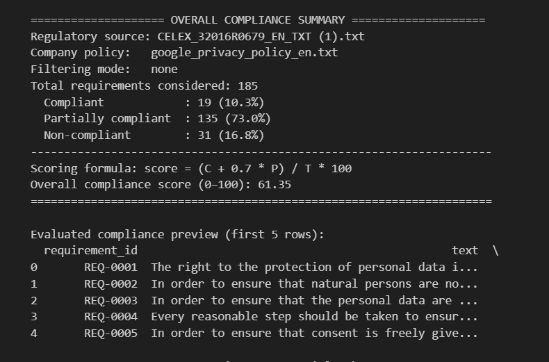

# Security Policy Compliance Automation

This project focuses on automating the tracking, evaluation, and reporting of security policy compliance across systems. It includes components for data collection, rule validation, visualization, and automated notification.

## Overview

The system analyzes configuration and monitoring data to determine whether machines follow defined security rules. A real-time dashboard, alerting mechanism, and automated report generator help ensure continuous compliance.

## Key Features

- Automated compliance checks using predefined security rules.
- Modular policy validation engine with easily configurable rule definitions.
- Visualization dashboards containing charts, tables, and compliance summaries.
- Automated reporting that highlights violations and provides remediation suggestions.
- Scalable architecture that supports multiple machines and policy categories.

## Architecture

1. **Data Collection Layer** – Retrieves logs, configurations, and system metrics.
2. **Compliance Engine** – Applies rules to classify each system as *Compliant* or *Non-Compliant*.
3. **Analytics & Reporting Layer** – Produces compliance scorecards, charts, and summaries.
4. **User Interface** – Dashboard for viewing real-time compliance status.

## Notebook Contents

The Jupyter Notebook includes:

- Data preprocessing steps  
- Policy rule definition examples  
- Compliance computation logic  
- Visualization outputs (matplotlib/plotly)  
- Summary report generation  

